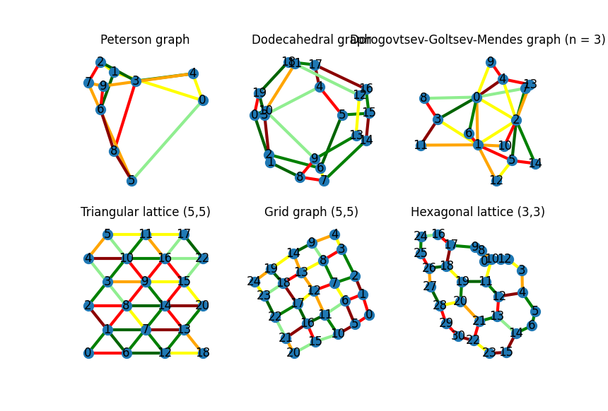

# IDMP-Constrained-Shortest-Path
 This project explores CP, SAT, and MIP technologies for solving the Constrained Shortest Path problem and compares their performance.

### Generating graphs
To generate the graph, move to the `graph_generation` run the following commands:
```
cd graph_generation
python generate_demo_graphs.py
```

The graph will be drawn and saved in the `graph_generation/graphs` folder.


To convert the graphs to the format used by the solvers, run the following command:
```
python read_graphs.py
```

The new files will be saved in the `graph_generation/data` folder.

### To convert .dzn instances to txt file use the following:
First, put the .dzn files that you want to convert in a cp_instances folder.
Next create an empty sat folder and run the following command:

```bash
python convert.py data/FRCSP_Instance_1.dzn
```

## Instructions for solving with CP

Navigate to ```cp/minizinc/Variants```. There you will find the ```run_all.py``` file which takes a single argument determining the type of problem to solve. To solve the Full Resource CSP, use ```frcsp```. To solve the Task-Constrained CSP, use ```tcsp```. The resulting command will look as follows:

```bash
python run_all.py tcsp
```

## Instructions for solving with SAT

### For running NCSP:
Navigate to sat-node-task folder and run:
```bash
python sat_directed_edges-idpool.py data-txt/SP_Instance_1-sat.txt node g3
```

### For running TCSP - ordered or unordered: (You need to add the number of task sets at the end of first line ...)
Navigate to sat-node-task folder and run:
```bash
python sat_directed_edges-idpool.py data-txt/SP_Instance_1-data.txt unordered_task g3
```

### Running with run_all.py for NCSP and TCSP
Navigate to sat-node-task folder and perform the following steps:
First create a folder output_sat, then inside it create to folders - g3 and m22. 
In each one of them, create two subfolders - node and unordered_task. 
Finally, to run all instances in the sat folder, run:
```bash
python run_all_with_sat.py sat-node-task
```